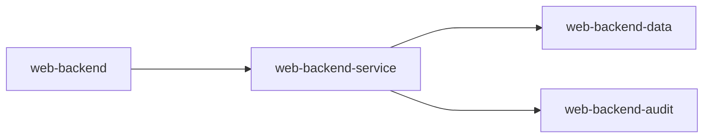
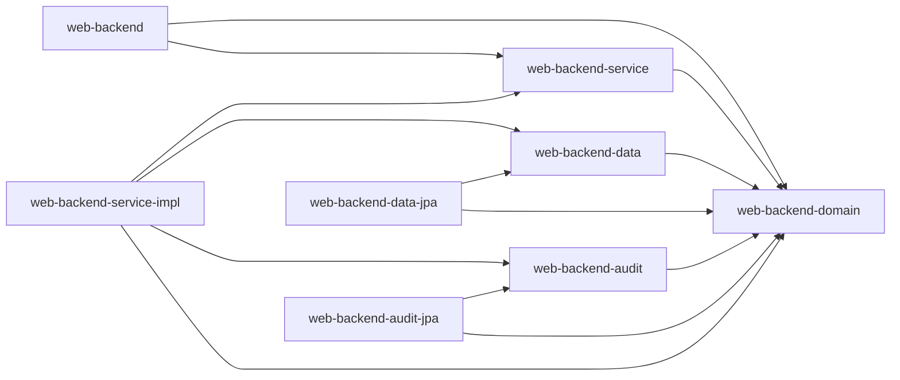

#### Module:
- **web-backend**:
    - Funktion: Hostet den ReST Service.
- **web-backend-service**:
    - Funktion: Definiert Interfaces für die Businesslogik.
- **web-backend-service-impl**:
    - Funktion: Implementiert die Businesslogik.
- **web-backend-domain**:
    - Funktion: Beinhaltet Domainklassen.
- **web-backend-data**:
    - Funktion: Definiert Interfaces für die Datenlogik.
- **web-backend-data-jpa**:
    - Funktion: Implementiert die Datenlogik mit JPA.
- **web-backend-audit**:
    - Funktion: Definiert Interfaces für die Auditlogik.
- **web-backend-audit-jpa**:
    - Funktion: Implementiert die Auditlogik mit JPA.

#### Abhängigkeiten der Module untereinander:
1. **Monolithischer Aufbau**:

    - Das gesamte System besteht aus dem einzigen Modul `web-backend`.
2. **Modularer Aufbau ohne Inversion of Control**:

    - `web-backend` ist abhängig von `web-backend-service`.
    - `web-backend-service` ist abhängig von `web-backend-data` und `web-backend-audit`.
3. **Modularer Aufbau mit Inversion of Control**:

    - `web-backend` hängt von `web-backend-service` ab.
    - `web-backend-service-impl` implementiert die Interfaces von `web-backend-service` und hängt von `web-backend-data` und `web-backend-audit` ab.
    - `web-backend-audit-jpa` und `web-backend-data-jpa` implementieren jeweils die Audit- und Daten-Interfaces.
    - Alle Module hängen von `web-backend-domain` ab, das die zentralen Domainklassen bereitstellt.

Durch die Beibehaltung der Bildreferenzen bleibt der visuelle Kontext der Modulstrukturen und ihrer Abhängigkeiten erhalten, was das Verständnis der architektonischen Gestaltung erleichtert. In der Inversion-of-Control-Struktur wird eine lose Kopplung bevorzugt, was die Modularität und Wartbarkeit des Systems verbessert.