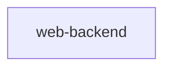
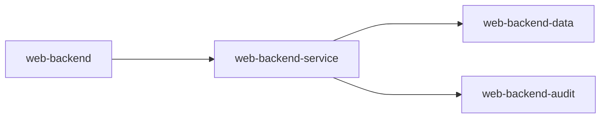
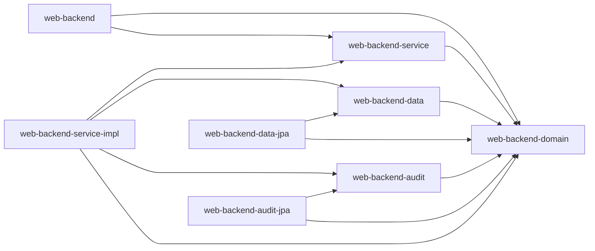

### Liste der Module
- web-backend: 
	- enthält den ReST Service 
- web-backend-service
	- enthält die Interfaces für die Businesslogik
- web-backend-service-impl
	- enthält die Implementierung der Busineslogik
- web-backend-domain
	- enthält die Domainklassen
- web-backend-data
	- enthält die Interfaces für die Datenlogik
- web-backend-data-jpa
	- enthällt die Implementierung der Datenlogik mit JPA
- web-backend-audit
	- enthält die Interfaces für die Auditlogik
- web-backend-audit-jpa
	- enthält die Implementierung der Auditlogik mit JPA

### Abhängigkeiten der Module voneinander

Es gibt drei Möglichkeiten die Module aufzubauen

##### Monolith

##### Module ohne ***Inversion of Control***

##### Module mit ***Inversion of Control***

Das Modul ***web-backend*** hängt von ***web-backend-service*** ab.
Das Modul ***web-backend-service*** hängt von ***web-backend-service***, ***web-backend-data*** und ***web-backend-audit*** ab.
Das Modul ***web-backend-audit*** hängt von ***web-backend-audit-jpa*** ab.
Das Modul ***web-backend-data*** hängt von ***web-backend-data-jpa*** ab.

Alle Module hängen von ***web-backend-domain*** ab